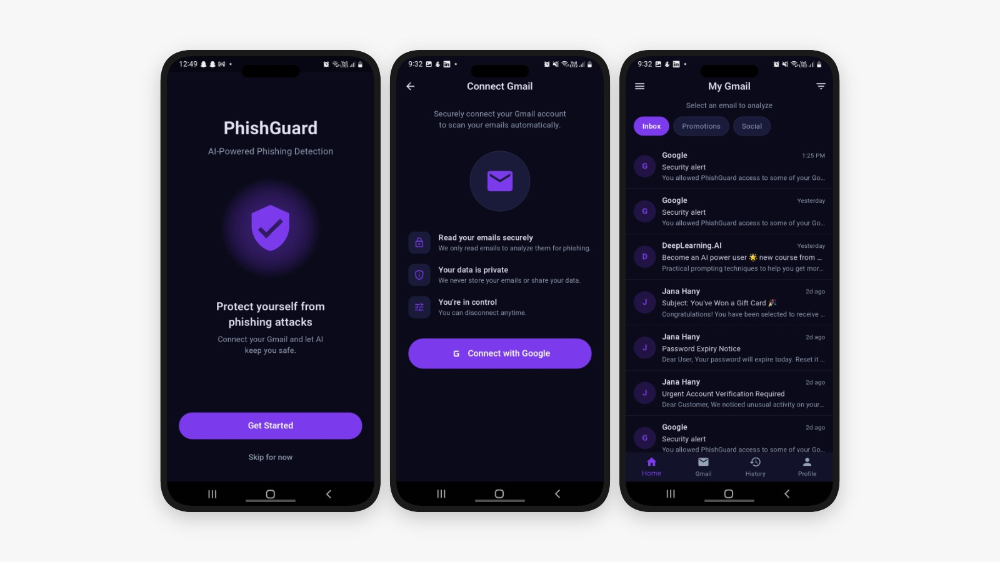
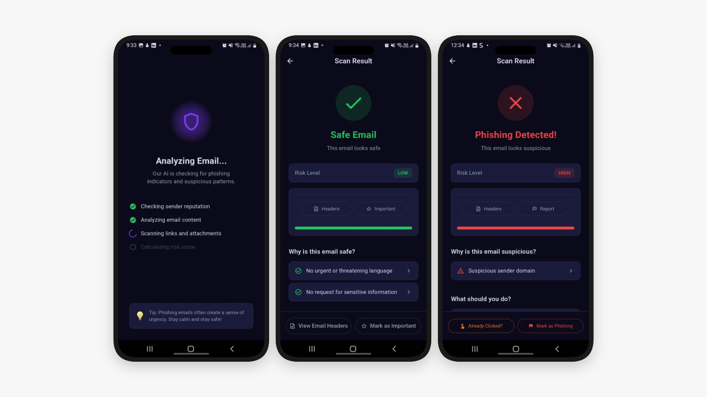
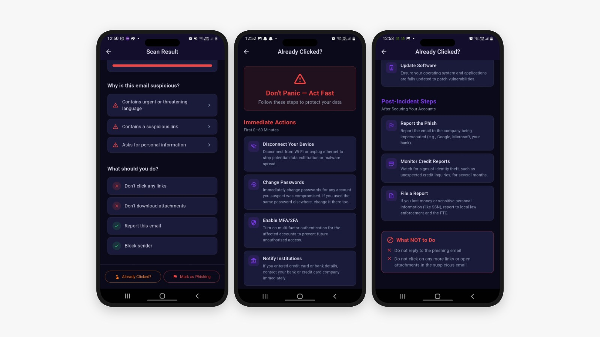

# PhishGuard — AI-Powered Phishing Email Detection


## 📖 Overview

Phishing attacks are one of the leading causes of data breaches, exploiting users through deceptive emails that imitate trusted sources. PhishGuard is a cross-platform mobile app that connects to Gmail and uses a Machine Learning model to detect phishing emails in real time. It analyzes email content and structure, classifies messages as safe or phishing with confidence, risk level, URL detection, and clear reasons.

## App Screens

| Onboarding, Gmail Connect, Inbox | Analysis and Results | Phishing Guidance |
| --- | --- | --- |
|  |  |  |


## 🔍 How It Works

The app is composed of two tightly integrated layers: a **Flutter frontend** handling the user experience and Gmail connectivity, and a **Python backend microservice** responsible for all ML inference.

### 1 — Authentication & Inbox Access
The user signs in with their Google account via OAuth 2.0. PhishGuard requests only the `gmail.modify` scope, which allows reading emails and applying labels — nothing more. Once authenticated, the Gmail API fetches real messages from the user's **Inbox**, **Promotions**, and **Social** tabs, parsed into structured `EmailModel` objects complete with sender, subject, body, date, and category.

### 2 — Email Analysis Pipeline
When the user selects an email for scanning, the app sends a `POST` request to the FastAPI backend containing the sender address, subject line, and full body text. The backend then:

**Step 1 — Text Cleaning**
The raw text is normalised: HTML tags are stripped, URLs are replaced with a placeholder token (`url`), punctuation and digits are removed, and the result is lowercased. This produces a clean, consistent representation for the vectoriser.

**Step 2 — TF-IDF Vectorisation**
The cleaned text is transformed into a sparse numerical vector using a **pre-fitted TF-IDF (Term Frequency–Inverse Document Frequency) vectoriser**. TF-IDF assigns higher weights to terms that are rare across the training corpus but frequent in this specific email — precisely the kind of vocabulary (e.g. *"verify your account"*, *"suspend"*, *"wire transfer"*) that distinguishes phishing content from legitimate communication.

**Step 3 — Numerical Feature Extraction**
In parallel, 9 hand-crafted numerical features are computed from the raw email:

| Feature | Rationale |
|---|---|
| URL presence | Phishing emails almost always contain links |
| Subject character length | Very long or very short subjects are anomalous |
| Body character length | Extremely terse or verbose bodies signal manipulation |
| Subject word count | Structural pattern indicator |
| Body word count | Structural pattern indicator |
| Exclamation mark count | Urgency signalling |
| Dollar sign count | Financial lure indicator |
| Uppercase character ratio | Shouting / pressure tactics |
| Trusted sender domain | gmail.com, outlook.com, yahoo.com, etc. are considered common |

**Step 4 — Feature Fusion & Classification**
The TF-IDF sparse vector and the numerical feature array are **horizontally stacked** into a single combined feature matrix using `scipy.sparse.hstack`. This unified representation is passed to the **Naive Bayes classifier**, which outputs a binary prediction (`phishing` / `safe`) alongside a probability score for each class.

**Step 5 — Risk Scoring & Explanation**
The raw probability is translated into a human-friendly **confidence percentage** and a **risk level** (`low`, `medium`, or `high`). A rule-based explanation engine then inspects the email against each phishing signal and produces a set of plain-English **reason statements** — e.g. *"Suspicious sender domain"*, *"Contains urgent or threatening language"*, *"Asks for personal information"* — which are surfaced directly in the app alongside the verdict.

### 3 — Result Display & Gmail Actions
The scan result screen presents:
- A clear **Phishing Detected / Safe Email** verdict with a colour-coded icon
- A **risk level badge** and an animated **confidence bar**
- A list of **reasons** explaining the classification
- Contextual **security advice** (what to do / what to avoid)
- An **"Already Clicked?"** screen with step-by-step recovery guidance for users who interacted with a suspicious email before scanning it
- A **"Mark as Phishing"** button that programmatically applies a `Phishing` Gmail label to the email and removes it from the inbox in one tap — no manual navigation required

### 4 — Scan History
Every completed scan is persisted to a local **SQLite database** using `sqflite`. The History screen lets users review all past results, giving them an audit trail of their inbox security over time without requiring any cloud storage or additional account.

---

## Features

- Google OAuth sign-in and Gmail inbox access.
- Email scanning through a deployed FastAPI ML endpoint.
- Scan results with label, confidence, risk level, and reasons.
- Detection signals such as URLs, suspicious domains, urgent language, sensitive-data requests, and formatting cues.
- Local SQLite scan history with filtering and weekly statistics.
- Dark mobile UI with safe/phishing result states.
- Post-click guidance for users who interacted with a suspicious email.


---

## 🏗️ Architecture

PhishGuard is built on a clean **MVC (Model-View-Controller)** pattern on the Flutter side, with Provider as the state management layer, and a decoupled **Python microservice** handling all inference workloads.

```
┌──────────────────────────────────────────────────────┐
│                  Flutter Application                 │
│                                                      │
│  Views ──────► Controllers ──────► Services          │
│  (UI screens)   (business logic)   (API, Gmail, DB)  │
│                      │                               │
│                   Models                             │
│              (data structures)                       │
└───────────────────────┬──────────────────────────────┘
                        │ HTTP POST
                        ▼
          ┌─────────────────────────┐
          │   Python FastAPI        │
          │   phishguard_backend.py │
          │                         │
          │  TF-IDF + Naive Bayes   │
          │  Numerical Features     │
          │  Explanation Engine     │
          └─────────────────────────┘
```

## 🤖 ML Models

Three classifiers were trained and shipped with the app. **Naive Bayes** is active by default.

| Model | File | Characteristics |
|---|---|---|
| **Naive Bayes** *(active)* | `naive_bayes_model.joblib` | Fast, low memory, strong baseline for text |
| Logistic Regression | `lr_model.joblib` | Linear boundary, good generalisation |
| Random Forest | `Random_Forest_model.joblib` | Ensemble, robust on edge cases |

All three share the same TF-IDF vectoriser (`tfidf_vectorizer.joblib`) and are drop-in interchangeable via a single config line in the backend.

---


## Tech Stack

| Part | Tools |
| --- | --- |
| Mobile | Flutter, Dart, Provider |
| Gmail integration | Google Sign-In, Gmail API |
| Local storage | SQLite, `sqflite` |
| Backend | Python, FastAPI, Uvicorn |
| ML | scikit-learn, TF-IDF, Naive Bayes, joblib |
| Deployment | Google Cloud Run |


## 📡 API Reference

### `POST /`

Analyse a single email for phishing indicators.

**Request Body**

```json
{
  "sender": "support@suspicious-domain.xyz",
  "subject": "URGENT: Verify your account now!",
  "body": "Click here immediately to avoid account suspension..."
}
```

**Response**

```json
{
  "label": "phishing",
  "confidence": 0.9432,
  "risk_level": "high",
  "has_url": true,
  "reasons": [
    "Suspicious sender domain",
    "Contains urgent or threatening language",
    "Contains a suspicious link"
  ],
  "model_used": "naive_bayes_model.joblib"
}
```

| Field | Type | Values |
|---|---|---|
| `label` | `string` | `"phishing"` or `"safe"` |
| `confidence` | `float` | 0.0 – 1.0 |
| `risk_level` | `string` | `"low"` · `"medium"` · `"high"` |
| `has_url` | `boolean` | URL detected in subject or body |
| `reasons` | `string[]` | Human-readable explanation |
| `model_used` | `string` | Active model filename |

---


Risk level logic:

| Level | Meaning |
| --- | --- |
| `high` | phishing with confidence >= 80% |
| `medium` | phishing with confidence < 80% |
| `low` | safe email |

## Project Structure

```text
phishguard/
  lib/
    controllers/      # auth, email, scan, history state
    models/           # email, scan result, history, user models
    services/         # Gmail API, backend API, SQLite
    utils/            # constants, routes, theme
    views/            # onboarding, inbox, result, history, profile, tips
    main.dart
  backend/
    phishguard_backend.py
    requirements.txt
    naive_bayes_model.joblib
    tfidf_vectorizer.joblib
    lr_model.joblib
    Random_Forest_model.joblib
  notebook/
    Phishing_email notebook.ipynb
  screens/
    1.jpeg
    2.jpeg
    3.jpeg
  assets/
  pubspec.yaml
```

## Main Dependencies

```yaml
provider: ^6.1.2
google_sign_in: ^6.2.1
googleapis: ^13.2.0
googleapis_auth: ^1.6.0
extension_google_sign_in_as_googleapis_auth: ^2.0.12
http: ^1.2.1
sqflite: ^2.3.3
fl_chart: ^0.68.0
lottie: ^3.1.2
shimmer: ^3.0.0
shared_preferences: ^2.2.3
```

## 👩‍💻 Author

**Jana Hany**  


## 📬 Contact

[GitHub](https://github.com/jana-h-any): @jana-h-any

[LinkedIn](www.linkedin.com/in/jana-hany) : [jana-hany]

[Email](janahanymostafa.h@gmail.com): [janahanymostafa.h@gmail.com]
